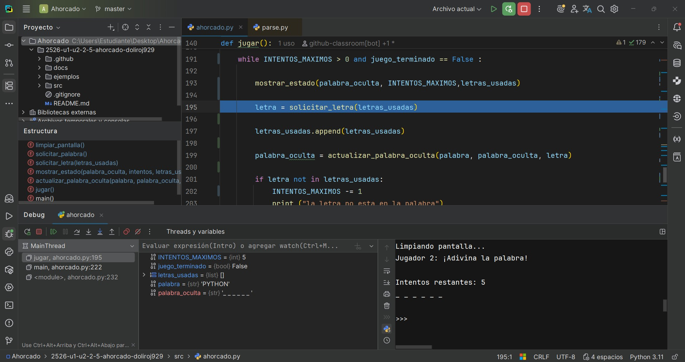
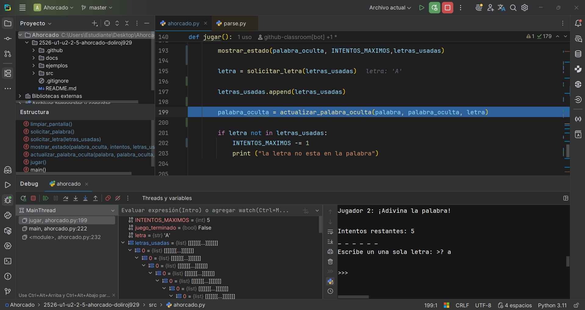
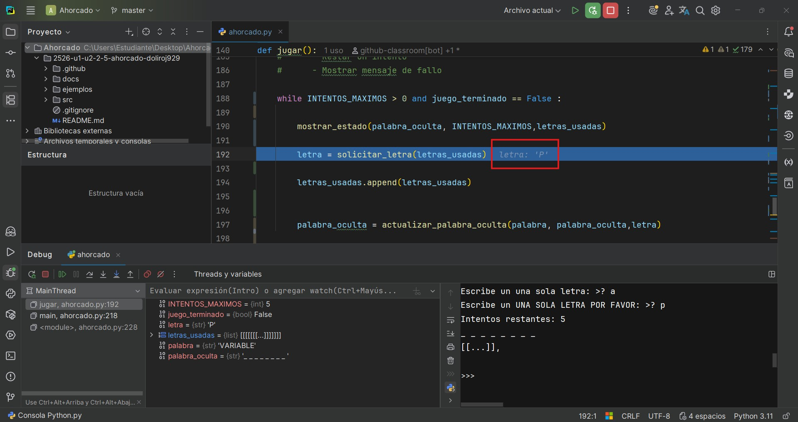

Identifiqué el botón de **debugger** y los botones principales para leer o entender nuestro código.

Hay dos botones principales:

-   **Paso a paso por procedimiento**
    
-   **Paso a paso por instrucciones**
    

Pude verificar que pasé un parámetro incorrecto en `letras_usadas` y la misma lista, por eso se creaba un tipo de bucle interno.

